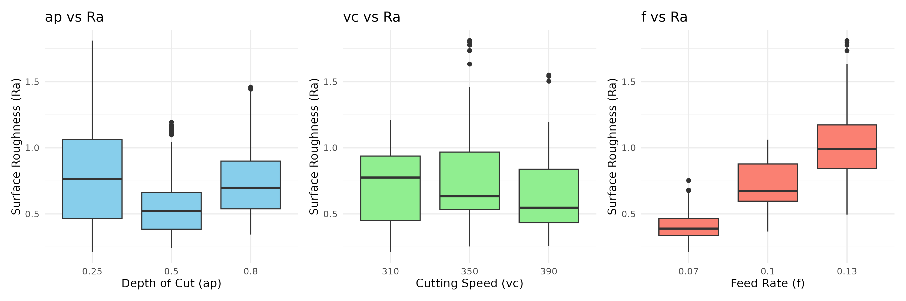
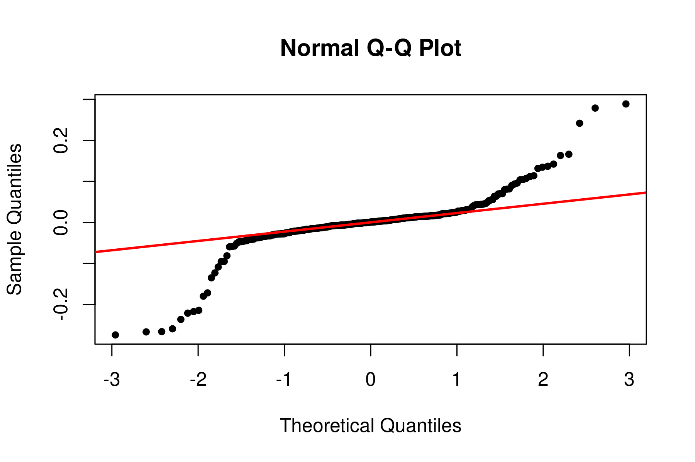

# Mixed-Effects Analysis of CNC Surface Roughness

## Overview

This project presents an end-to-end statistical analysis of CNC turning surface roughness using **R** and **mixed-effects modeling**. The objective is to investigate how machining parameters influence surface roughness while accounting for repeated measurements through random effects.

The analysis demonstrates a reproducible statistical workflow, including model fitting, hypothesis testing, residual diagnostics, and data visualization.

---

## Objectives

- Evaluate the effects of **depth of cut (ap)**, **cutting speed (vc)**, and **feed rate (f)** on surface roughness (Ra).
- Account for repeated measurements using a mixed-effects model.
- Assess model assumptions through diagnostic analyses.
- Produce publication-quality tables and visualizations.

---

## Dataset

- **Source:** Kaggle CNC Turning Dataset
- **Response Variable:** Surface Roughness (Ra)
- **Predictor Variables:**
  - Depth of Cut (ap)
  - Cutting Speed (vc)
  - Feed Rate (f)

---

## Statistical Methods

- Exploratory Data Analysis (EDA)
- Mixed-Effects Linear Modeling (`nlme`)
- Type III ANOVA
- Residual Diagnostics
- Variance Assessment
- Model Performance Evaluation

---

## R Packages

- `nlme`
- `ggplot2`
- `patchwork`
- `car`
- `performance`
- `modelsummary`
- `knitr`
- `kableExtra`

---

## Repository Structure

```text
mixed-effects-cnc-analysis/
├── notebooks/
│   └── cnc_surface_roughness_analysis.ipynb
├── figures/
│   ├── boxplots_by_factor.png
│   ├── qq_plot.png
├── report/
│   └── final_report.pdf
├── README.md
└── LICENSE
```

---

## Results

### Distribution of Surface Roughness



### Normal Q-Q Plot



---

## Key Findings

- Mixed-effects modeling accounted for repeated measurements within machining runs.
- Feed rate had the strongest influence on surface roughness among the machining parameters.
- Diagnostic analyses supported evaluation of model assumptions, including residual normality and homoscedasticity.
- The workflow demonstrates reproducible statistical analysis using real manufacturing data.

---

## Skills Demonstrated

- R Programming
- Statistical Modeling
- Mixed-Effects Models
- ANOVA
- Experimental Design
- Data Visualization
- Regression Diagnostics
- Technical Reporting
- Reproducible Research

---

## Author

**Lucas Russo**

Bachelor of Science in Mathematics

This project was completed as part of my statistics portfolio to demonstrate practical applications of statistical modeling and data analysis in manufacturing.
